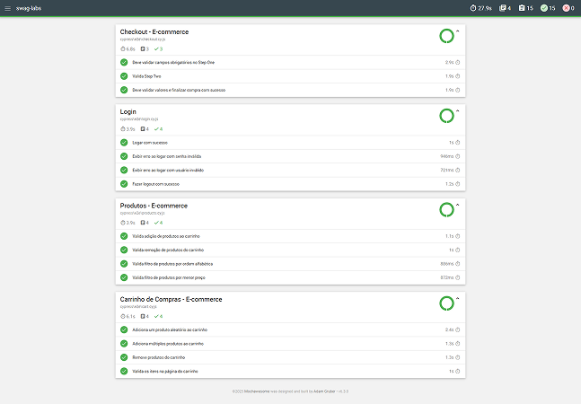

# 🛒 Cypress Swag Labs

[](https://www.cypress.io/)
[](LICENSE)

Projeto de automação de testes **E2E** desenvolvido com **Cypress** no e-commerce demo [Swag Labs](https://www.saucedemo.com/).  
O projeto cobre fluxos críticos: **Login, Produtos, Carrinho e Checkout**, validando desde o acesso até a finalização de uma compra.

---

## 🚀 Tecnologias
- [Cypress](https://www.cypress.io/) ^15.3.0  
- [@faker-js/faker](https://fakerjs.dev/) para geração dinâmica de dados  
- [cypress-mochawesome-reporter](https://www.npmjs.com/package/cypress-mochawesome-reporter) para relatórios  

---

## 📂 Estrutura do Projeto

```
cypress-swag-labs/
│
├── cypress/
│   ├── e2e/
│   │   ├── login.cy.js
│   │   ├── products.cy.js
│   │   ├── cart.cy.js
│   │   └── checkout.cy.js
│   │
│   ├── fixtures/
│   │   └── users.json
│   │
│   ├── support/
│   │   ├── commands.js
│   │   └── e2e.js
│
├── cypress.config.js
├── package.json
└── README.md
```

---

## 🧪 Cenários de Teste

### 🔑 **Login**
- Logar com sucesso
- Exibir erro ao logar com **senha inválida**
- Exibir erro ao logar com **usuário inválido**
- Fazer **logout com sucesso**

---

### 📦 **Produtos**
- Adicionar um produto aleatório ao carrinho
- Remover produto do carrinho
- Validar filtro de produtos por **ordem alfabética (A–Z)**
- Validar filtro de produtos por **menor preço**

---

### 🛒 **Carrinho**
- Adicionar **um produto aleatório** ao carrinho
- Adicionar **múltiplos produtos aleatórios** ao carrinho
- Remover produtos do carrinho (um a um)
- Validar itens exibidos na página do carrinho (nome, quantidade e preço)

---

### 💳 **Checkout**
- Validar **campos obrigatórios** no Step One (First Name, Last Name, Postal Code)
- Preencher corretamente e avançar para o **Step Two**
- Validar dados do **Step Two** (produto, subtotal, imposto e total)
- Finalizar compra com sucesso e validar tela de **confirmação de pedido**
- Voltar para a home e validar carrinho vazio

---

## ⚙️ Instalação

Clone o repositório e instale as dependências:

```bash
git clone https://github.com/seuusuario/cypress-swag-labs.git
cd cypress-swag-labs
npm install
```

---

## ▶️ Como executar os testes

### Modo interativo (GUI):
```bash
npx cypress open
```

### Modo headless:
```bash
npx cypress run
```

---

## 📊 Relatórios

Este projeto utiliza **cypress-mochawesome-reporter** para gerar relatórios em HTML.

1. Rodar os testes:
```bash
npm run test
```

2. Gerar o relatório:
```bash
npm run report
```

3. Abrir o relatório em:
```
cypress/reports/html/index.html
```

### 📸 Exemplo de relatório gerado


---

## 👨‍💻 Autor

**Binho**  
Analista de QA | Automação de Testes | Cypress E2E  
📌 [LinkedIn](https://www.linkedin.com/) • [GitHub](https://github.com/seuusuario)

---

## 📜 Licença

Este projeto está sob a licença **MIT**.  
Sinta-se à vontade para usar e modificar 🚀
